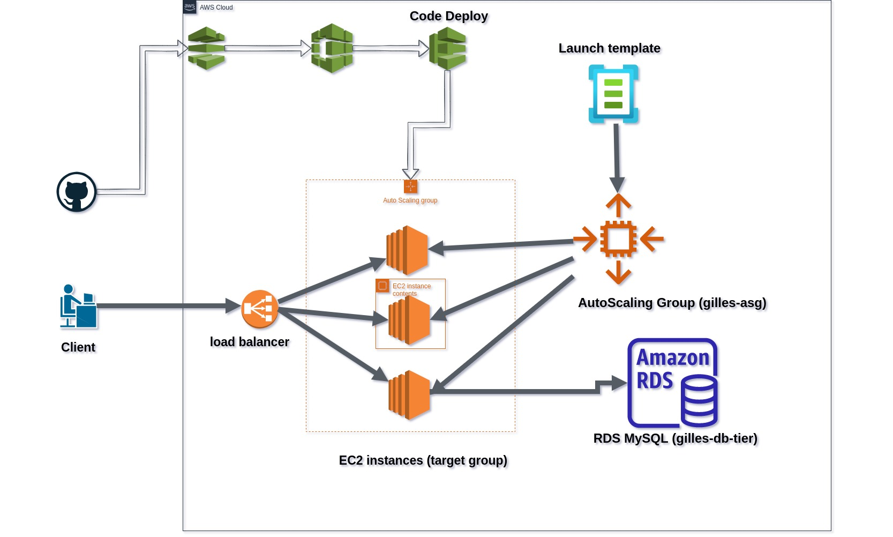
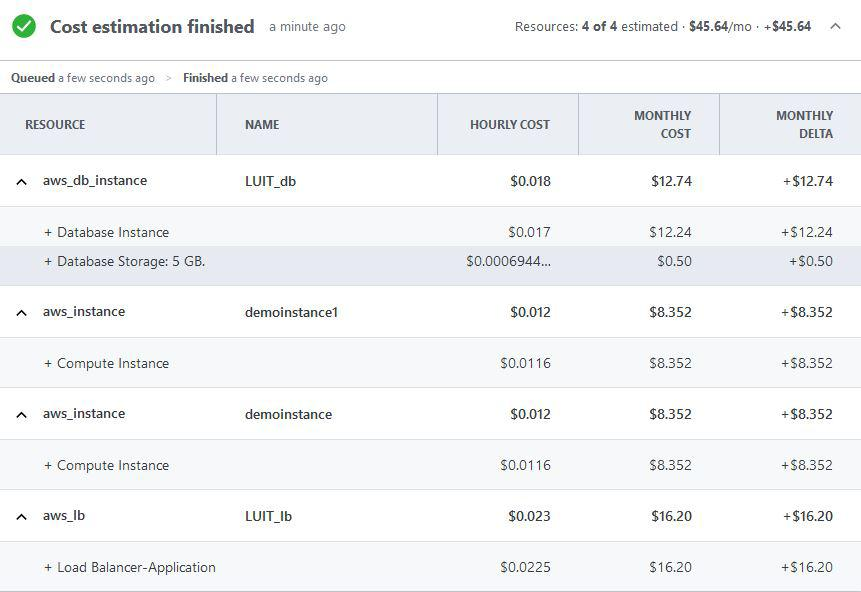

# Scopic Software - DevOps Skill Test
The application is split in 2 micro app, a backend and a frontend, To deploy the application, I made a script that clone the code on the server, create the production version (build) install the necessary, and I use PM2 to run the code in background as a daemon. I set up an autoscaling group that automatically creates instances from a launch template with a maximum of 3 instances, and I also created a load balancer to distribute the load of the tasks to the different instances. The application benefits from a high availability, here is the  [LOAD BALANCER Public DNS LINK to open the app](htps://gilles-asg1-1-95532259.ap-southeast-1.elb.amazonaws.com) .
The diagram below details the work done.

## Deployment Diagram

- Ec2 Instances runingin ubuntu OS to host app
- Lauch template has been create to generate new instance __gilles-asg-template__
- AutoScaling group to create new instance to handle the load for the application 
- MySQL RDS database to host data
    * aws_db_name = gilles-db-tier
    * aws_db_password = P6JBO25c0bW&

- Code Deploy and Github for CD
- Load balancer for balancing the loads on the different instances

## CD / Deployment
- The project is hosted on the public github repository that has been used for the CD
https://github.com/chrissinkep/gilles-christian-simple-inventory-app.git
- The deployment scripts are located in ./deploy.sh

## How does the app Scale
AWS Ec2 Auto Scaling helps you make sure that you have the right number of EC2 instances available to handle the load for the application. when when cpu usage exceeds 20%, on the instance a new ones are automatically created with same launch template in or out different subnet
- scaling policy: avg cpu utilisation for load balancer 50%

## Security Steps
- Set MFA authentication on the account
- Set a new password on rds db
- Only Ec2 instances can access the db (gilles-db-tier.czdsnotlnwwp.ap-southeast-1.rds.amazonaws.com)
- Using AWS Secrets Manager to provide application access to database credentials
- Using Security Groups to control access what network traffic, protocols, and ports are accepted by the application’s servers 41.75

## Cost Calculation

We have a Total of **$45.64/month**

## Cost Estimation
- For 100 Simultaneous requests/seconds : $41.76
- For 1000 Simultaneous requests/seconds : $252
- For 10000 Simultaneous requests/seconds : $354,40